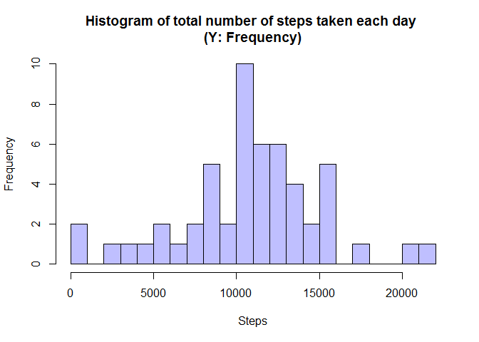
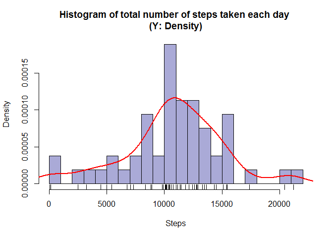
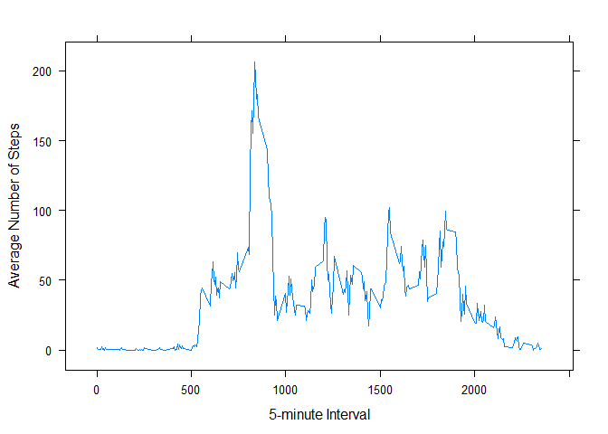
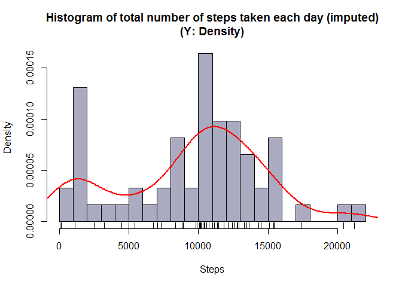
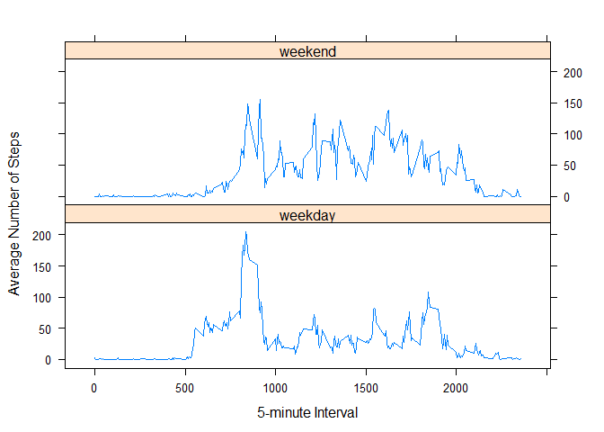

# Reproducible Research: Peer Assessment 1


## Loading and preprocessing the data


>Show any code that is needed to
>
> 1. Load the data (i.e. `read.csv()`)
>
> 2. Process/transform the data (if necessary) into a format suitable for your analysis

### 0. Check if the data exists in the working directory

Before loading the data, check if the data file exist in the working directory. If only the zip file exists, then extract the zip file.  


```r
if (!file.exists("activity.csv")){
        if (file.exists("activity.zip")){
                unzip("activity.zip")
        } else{
                message("'activity.zip' file cannot be found.")
        }
}
```

If either `activity.csv` or `activity.zip` file does not exist in the working directory, the the message will tell you so.  You should then halt the analysis here and make sure to properly fork the specified Github repo and/or set the R working directory correctly.

### 1. Load the data

Now we should have `activity.csv` in the working directory.  
Load it to a data frame as `activity.df`.

```r
activity.df <- read.csv("activity.csv")
```

Let's take a look at the head and tail of `activity.df` data frame.

```r
head(activity.df)
```

```
##   steps       date interval
## 1    NA 2012-10-01        0
## 2    NA 2012-10-01        5
## 3    NA 2012-10-01       10
## 4    NA 2012-10-01       15
## 5    NA 2012-10-01       20
## 6    NA 2012-10-01       25
```

```r
tail(activity.df)
```

```
##       steps       date interval
## 17563    NA 2012-11-30     2330
## 17564    NA 2012-11-30     2335
## 17565    NA 2012-11-30     2340
## 17566    NA 2012-11-30     2345
## 17567    NA 2012-11-30     2350
## 17568    NA 2012-11-30     2355
```


Also, summary of data.

```r
summary(activity.df)
```

```
##      steps                date          interval     
##  Min.   :  0.00   2012-10-01:  288   Min.   :   0.0  
##  1st Qu.:  0.00   2012-10-02:  288   1st Qu.: 588.8  
##  Median :  0.00   2012-10-03:  288   Median :1177.5  
##  Mean   : 37.38   2012-10-04:  288   Mean   :1177.5  
##  3rd Qu.: 12.00   2012-10-05:  288   3rd Qu.:1766.2  
##  Max.   :806.00   2012-10-06:  288   Max.   :2355.0  
##  NA's   :2304     (Other)   :15840
```
### 2. Further processing/transformation of data

No further processing/transformation of data is performed.
However, load `dplyr` package for the ease of data manipulation hereafter and `lattice` package for graphics.


```r
library(dplyr)
library(lattice)
```


## What is mean total number of steps taken per day?
>For this part of the assignment, you can ignore the missing values in the dataset.
>
> 1. Make a histogram of the total number of steps taken each day
>
> 2. Calculate and report the **mean** and **median** total number of steps taken per day

### 1. Make a histogram
First create another data frame, `activity_day.df`, which contains aggregated steps (`sum_steps`) for each day.
Also, remove NAs by using `dplyr::filter` command.

```r
activity_day.df <- activity.df %>%
        filter(!is.na(steps)) %>%
        group_by(date) %>%
        summarize(sum_steps = sum(steps, na.rm = TRUE))
```

Make a histogram of `activity_day.df`.

```r
hist(activity_day.df$sum_steps,
     main = "Histogram of total number of steps taken each day \n(Y: Frequency)",
     xlab = "Steps",
     col = "#0000ff40",
     breaks = 30)
```

 

Make another histogram while changing Y axis to *Density* instead of
*Frequency* by `freq = FALSE` option. Then add a density curve and rug.


```r
hist(activity_day.df$sum_steps,
     main = "Histogram of total number of steps taken each day \n(Y: Density)",
     xlab = "Steps",
     col = "#00008855",
     breaks = 30,
     freq = FALSE)
lines(density(activity_day.df$sum_steps), 
      col = "red", 
      lwd = 2)
rug(activity_day.df$sum_steps)
```

 

### 2. Calculate mean and median of total number of steps taken per day

Mean of the total number of steps taken per day is calculated as follows:

```r
mean_activity <- mean(activity_day.df$sum_steps)
mean_activity
```

```
## [1] 10766.19
```

Similarly, median of the total number of steps taken per day is as follows:

```r
median_activity <- median(activity_day.df$sum_steps)
median_activity
```

```
## [1] 10765
```


## What is the average daily activity pattern?
>1. Make a time series plot (i.e. `type = "l"`) of the 5-minute interval (x-axis) and the average number of steps taken, averaged across all days (y-axis)
>
>2. Which 5-minute interval, on average across all the days in the dataset, contains the maximum number of steps?


### 1. Plot time series

Let's create another data frame, `activity_interval.df`, which contains 5-minute interval and the average number of steps taken across all days per each interval.

```r
activity_interval.df <- activity.df %>%
        filter(!is.na(steps)) %>%
        group_by(interval) %>%
        summarize(steps = mean(steps, na.rm = TRUE))
```

Take a look at `activity_interval.df`.

```r
head(activity_interval.df, 6)
```

```
## Source: local data frame [6 x 2]
## 
##   interval     steps
##      (int)     (dbl)
## 1        0 1.7169811
## 2        5 0.3396226
## 3       10 0.1320755
## 4       15 0.1509434
## 5       20 0.0754717
## 6       25 2.0943396
```

```r
tail(activity_interval.df, 6)
```

```
## Source: local data frame [6 x 2]
## 
##   interval     steps
##      (int)     (dbl)
## 1     2330 2.6037736
## 2     2335 4.6981132
## 3     2340 3.3018868
## 4     2345 0.6415094
## 5     2350 0.2264151
## 6     2355 1.0754717
```

```r
summary(activity_interval.df)
```

```
##     interval          steps        
##  Min.   :   0.0   Min.   :  0.000  
##  1st Qu.: 588.8   1st Qu.:  2.486  
##  Median :1177.5   Median : 34.113  
##  Mean   :1177.5   Mean   : 37.383  
##  3rd Qu.:1766.2   3rd Qu.: 52.835  
##  Max.   :2355.0   Max.   :206.170
```

Plot `activity_interval.df` with X-axis: `interval` and Y-axis: `steps`.

```r
xyplot(steps~interval,
       data = activity_interval.df,
       type = "l",
       xlab = "5-minute Interval",
       ylab = "Average Number of Steps")
```

 

### 2. Find which 5-minute interval contains the maximum number of steps
Find the 5-min interval containing the maximum number of steps by the following command:

```r
activity_interval.df$interval[which(activity_interval.df$steps
                                    == max(activity_interval.df$steps))]
```

```
## [1] 835
```

By using `dplyr::filter` command, you can get the same result while confirming the maximum number of steps.

```r
filter(activity_interval.df, steps == max(activity_interval.df$steps))
```

```
## Source: local data frame [1 x 2]
## 
##   interval    steps
##      (int)    (dbl)
## 1      835 206.1698
```

## Imputing missing values
>Note that there are a number of days/intervals where there are missing values (coded as `NA`). The presence of missing days may introduce bias into some calculations or summaries of the data.
>
> 1. Calculate and report the total number of missing values in the dataset (i.e. the total number of rows with `NA`s)
> 
> 2. Devise a strategy for filling in all of the missing values in the dataset. The strategy does not need to be sophisticated. For example, you could use the mean/median for that day, or the mean for that 5-minute interval, etc.
>
> 3. Create a new dataset that is equal to the original dataset but with the missing data filled in.
>
> 4. Make a histogram of the total number of steps taken each day and Calculate and report the **mean** and **median** total number of steps taken per day. Do these values differ from the estimates from the first part of the assignment? What is the impact of imputing missing data on the estimates of the total daily number of steps?

### 1. Calculate and report the total number of missing values
The simplest command to calculate the total number of missing values in a data frame is:

```r
sum(is.na(activity.df))
```

```
## [1] 2304
```

In this dataset `activity.df`, variable `steps` is the only column that contains NAs,
so the above command would suffice.  In order to make sure not to double-count 
the number of NAs in the same rows, use the below command.


```r
nrow(filter(activity.df, is.na(steps) | is.na(date) | is.na(interval)))
```

```
## [1] 2304
```


### 2. Devise a strategy of imputation (filling in the missing values)
As suggested in the instruction, there are a few simple ways to fabricate the values to replace with NAs in the dataset.
Let's consider the below two cases:

 - Mean/median value of that day
 - Mean/median value of that 5-minute interval

The former way, however, might not be very useful. Browsing the original dataset, you will find that NAs likely exist throughout the day.  
Let's check if the initial insight is correct.  Below command finds the number of NAs on any days that contains NAs.

```r
activity.df %>%
        group_by(date) %>%
        filter(is.na(steps)) %>%
        summarize(sum(is.na(steps)))
```

```
## Source: local data frame [8 x 2]
## 
##         date sum(is.na(steps))
##       (fctr)             (int)
## 1 2012-10-01               288
## 2 2012-10-08               288
## 3 2012-11-01               288
## 4 2012-11-04               288
## 5 2012-11-09               288
## 6 2012-11-10               288
## 7 2012-11-14               288
## 8 2012-11-30               288
```
A day contains 288 5-minute intervals (`24 * 60 / 5`).  For each one of the days above, all 288 of 5-min intervals are indeed filled with NAs. This means that the calculation of mean/median values for those days would not produce any meaningful data.  

On the other hand, the latter method to use mean/median of 5-min intervals appears to be able to provide some meaningful data.  Let's compare the number of non-NA values and that of NAs as follows.

```r
activity.df %>%
        group_by(interval) %>%
        summarize(sum(!is.na(steps)), sum(is.na(steps)))  %>%
        summary
```

```
##     interval      sum(!is.na(steps)) sum(is.na(steps))
##  Min.   :   0.0   Min.   :53         Min.   :8        
##  1st Qu.: 588.8   1st Qu.:53         1st Qu.:8        
##  Median :1177.5   Median :53         Median :8        
##  Mean   :1177.5   Mean   :53         Mean   :8        
##  3rd Qu.:1766.2   3rd Qu.:53         3rd Qu.:8        
##  Max.   :2355.0   Max.   :53         Max.   :8
```
We get 53 non-NA days out of the total 61 days.


I decided to go with **median of 5-min interval** because *Median* preserves the original variable type (`integer`), whereas using *Mean* would yield the mismatch of the variable type (`mean: double`), and thus require extra steps to convert the variable type appropriately.
 
### 3.  Create a copy of the original dataset with imputation
Create another dataset from the original while replacing NAs with the median of that 5-min interval across all days, and name it `activity_imputed.df`.

```r
activity_imputed.df <- activity.df %>%
        group_by(interval) %>%
        mutate(steps = ifelse(is.na(steps), median(steps, na.rm = TRUE), steps))
```

### 4. Make a histogram of the new dataset with imputation
Similar to creating the histogram of the original dataset, you need to create another data frame, `act_imp_day.df`,  where `steps` are aggregated by date (`sum_steps`).

```r
act_imp_day.df <- activity_imputed.df %>%
        filter(!is.na(steps)) %>%
        group_by(date) %>%
        summarize(sum_steps = sum(steps, na.rm = TRUE))
```

Create a histogram.

```r
hist(act_imp_day.df$sum_steps,
     main = "Histogram of total number of steps taken each day (imputed)\n(Y: Density)",
     xlab = "Steps",
     col = "#00004455",
     breaks = 30,
     freq = FALSE)
lines(density(act_imp_day.df$sum_steps), 
      col = "red", 
      lwd = 2)
rug(act_imp_day.df$sum_steps)
```

 

Mean of the total number of steps taken per day with imputation.

```r
mean_activity_imp <- mean(act_imp_day.df$sum_steps)
mean_activity_imp
```

```
## [1] 9503.869
```

Median of the total number of steps taken per day with imputation.

```r
median_activity_imp <- median(act_imp_day.df$sum_steps)
median_activity_imp
```

```
## [1] 10395
```

Here is the comparison of mean and median values between the original dataset and the new dataset with imputation (NAs being replaced with the median of 5-min interval).

|                         | Mean                  | Median                  |
|-------------------------|-----------------------|-------------------------|
| Original Dataset        | 1.0766189\times 10^{4}     | 10765     |
| New Dataset with imputation | 9503.8688525 | 10395 |
| Diff: `new - original`  | **-1262.3198268** | **-370** |

## Are there differences in activity patterns between weekdays and weekends?

>For this part the `weekdays()` function may be of some help here. Use the dataset with the filled-in missing values for this part.
>
> 1. Create a new factor variable in the dataset with two levels -- "weekday" and "weekend" indicating whether a given date is a weekday or weekend day.
>
> 2. Make a panel plot containing a time series plot (i.e. `type = "l"`) of the 5-minute interval (x-axis) and the average number of steps taken, averaged across all weekday days or weekend days (y-axis). The plot should look something like the following, which was created using **simulated data**:

### 1. Create a new factor variable with two levels: "weekday" and "weekend" in the dataset

Create another data frame `act_imp_wday.df` from the imputed data frame created in the previous section and add a new factor variable `wday` which has two levels: `weekday` and `weekend`.

```r
act_imp_wday.df <- activity_imputed.df %>%
        mutate(wday = ifelse(weekdays(as.Date(date), abbreviate = TRUE) %in% c("Sun", "Sat"),
                                  "weekend", "weekday")) %>%
        mutate(wday = as.factor(wday)) # change to factor
```

### 2. Make a panel plot containing a time series plot

Create another data frame `act_interval_comp.df` grouping by both `interval` and `wday`, and calculate `mean` within those groups.

```r
act_interval_comp.df <- act_imp_wday.df %>%
        group_by(interval, wday) %>%
        summarize(steps = mean(steps, na.rm = TRUE))
```

Plot using multipanels.

```r
xyplot(steps~interval|wday,
       data = act_interval_comp.df,
       type = "l",
       xlab = "5-minute Interval",
       ylab = "Average Number of Steps",
       layout = c(1,2))
```

 
